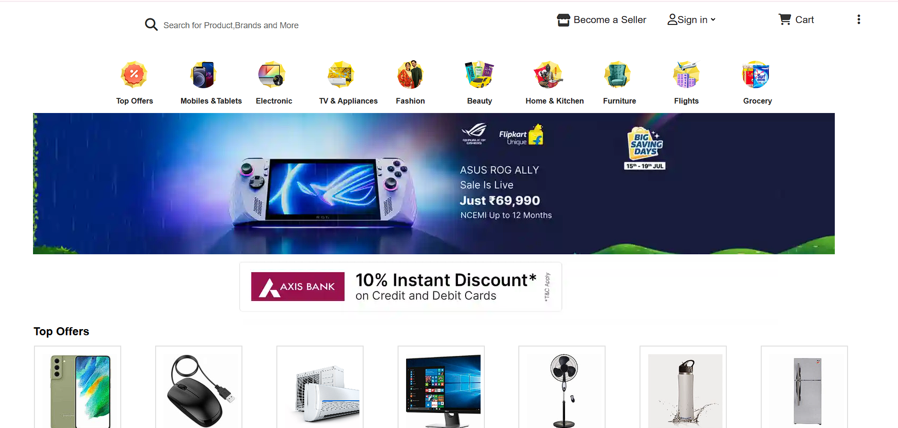

# 🛒 Flipkart Clone UI

A frontend clone of Flipkart built using HTML and CSS, designed to replicate the look and feel of the original e-commerce platform.

## 📸 Preview

## 🛠️ Tech Stack

* HTML5
* CSS3

## ✨ Features

* Responsive Design
* Product Sections
* Navigation Bar
* Modern UI Layout
* Mobile-Friendly Design

## 🌐 Live Demo

Add your deployed link here.

## 👨‍💻 Author

**Shivam Sahil**

GitHub: https://github.com/shivamsahil030
